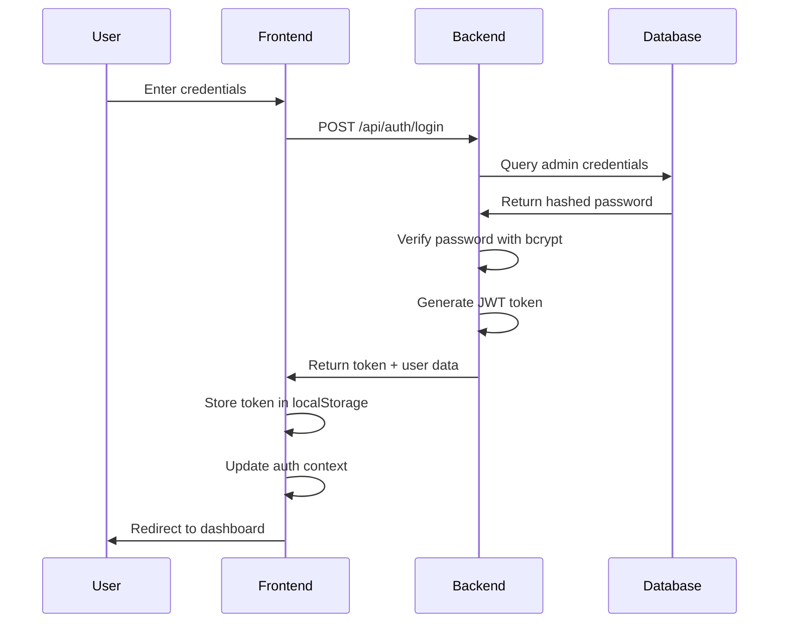
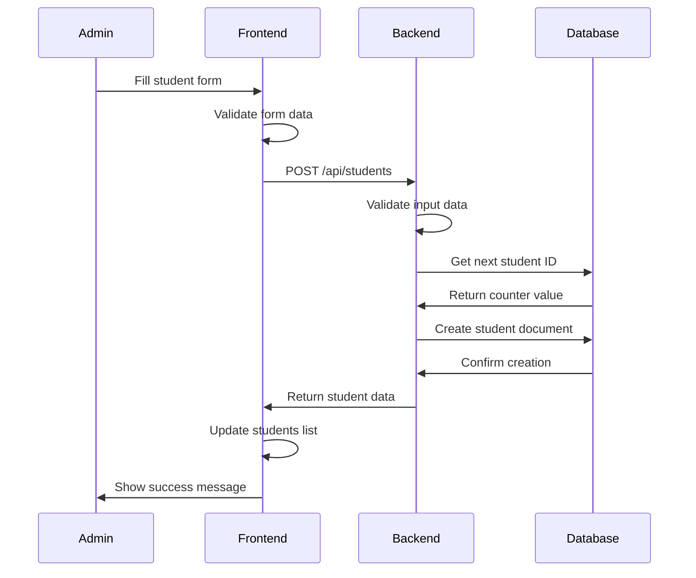
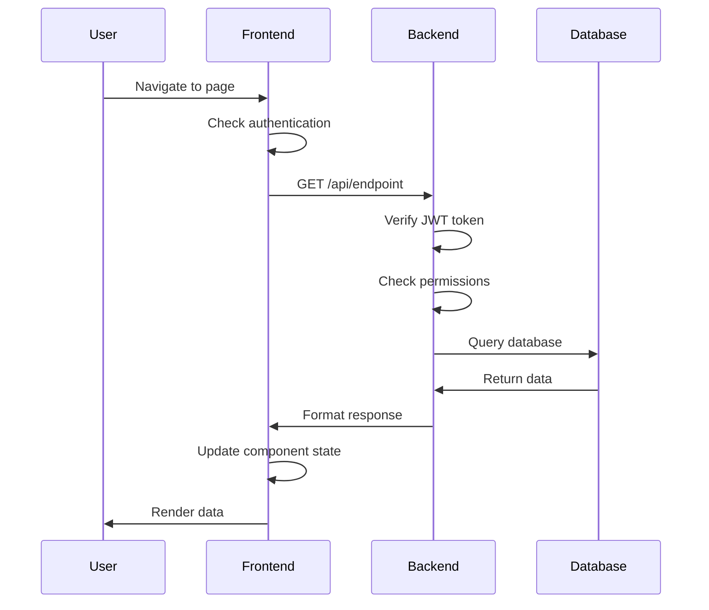

# 👥 Student Portal - User Flow Documentation

## Overview

This document describes the user personas, typical workflows, and interaction patterns for the Student Portal system. It provides a comprehensive understanding of how different users interact with the system and the underlying technical flows.

## 👤 User Personas

### 1. System Administrator (Admin)
**Role:** Full system access and management
**Responsibilities:**
- Manage all system users and data
- Configure system settings
- Monitor system performance
- Handle data backups and maintenance

**Access Level:** Full access to all features and data

---

### 2. School Administrator (Future Role)
**Role:** School-level management and oversight
**Responsibilities:**
- Manage school-specific data
- Generate reports and analytics
- Oversee teacher and student management
- Handle academic planning

**Access Level:** School-specific data and management features

---

### 3. Teacher (Future Role)
**Role:** Classroom and academic management
**Responsibilities:**
- Manage assigned classes
- Track student attendance
- Input and manage grades
- Generate class reports

**Access Level:** Assigned classes and students only

---

### 4. Student (Future Role)
**Role:** Personal academic information access
**Responsibilities:**
- View personal academic records
- Check attendance and grades
- Access class schedules
- View academic progress

**Access Level:** Personal data only

---

### 5. Parent/Guardian (Future Role)
**Role:** Student progress monitoring
**Responsibilities:**
- Monitor child's academic progress
- View attendance records
- Access progress reports
- Communicate with teachers

**Access Level:** Child's academic information only

---

## 🔄 Core User Workflows

### 1. System Initialization Flow

#### Admin First-Time Setup
```
1. Install and configure system
   ↓
2. Run database migration scripts
   ↓
3. Generate JWT secret
   ↓
4. Hash admin password
   ↓
5. Initialize database counters
   ↓
6. First login with default credentials
   ↓
7. Change default password
   ↓
8. Configure system settings
```

**API Calls:**
- `POST /api/auth/login` - Initial authentication
- `PUT /api/auth/change-password` - Change default password
- `GET /api/auth/system-stats` - Verify system status

**Frontend Pages:**
- Login page
- Settings page

---

### 2. Daily Administrative Workflow

#### Morning Routine
```
1. Login to system
   ↓
2. Check dashboard for overnight alerts
   ↓
3. Review system statistics
   ↓
4. Check for pending tasks
   ↓
5. Review daily reports
```

**API Calls:**
- `POST /api/auth/login` - Authentication
- `GET /api/auth/system-stats` - System overview
- `GET /api/auth/profile` - User profile

**Frontend Pages:**
- Login page
- Dashboard page

---

#### Student Management Workflow
```
1. Navigate to Students page
   ↓
2. View current student list
   ↓
3. Search/filter students as needed
   ↓
4. Perform actions:
   - Add new student
   - Edit existing student
   - Transfer student to different class
   - Update student status
   - Delete student (if necessary)
   ↓
5. Review changes and confirm
```

**API Calls:**
- `GET /api/students` - List students
- `POST /api/students` - Create student
- `PUT /api/students/:id` - Update student
- `PUT /api/students/:id/transfer-class` - Transfer student
- `DELETE /api/students/:id` - Delete student

**Frontend Pages:**
- Students page
- Student form (add/edit)
- Student details view

---

#### Teacher Management Workflow
```
1. Navigate to Teachers page
   ↓
2. View current teacher list
   ↓
3. Search/filter teachers by department/status
   ↓
4. Perform actions:
   - Add new teacher
   - Edit teacher information
   - Assign subjects to teacher
   - Update work schedule
   - Change teacher status
   ↓
5. Review and confirm changes
```

**API Calls:**
- `GET /api/teachers` - List teachers
- `POST /api/teachers` - Create teacher
- `PUT /api/teachers/:id` - Update teacher

**Frontend Pages:**
- Teachers page
- Teacher form (add/edit)
- Teacher details view

---

#### Class Management Workflow
```
1. Navigate to Classes page
   ↓
2. View current class list
   ↓
3. Search/filter classes by grade/semester
   ↓
4. Perform actions:
   - Create new class
   - Assign teacher to class
   - Add subjects to class
   - Manage class capacity
   - Update class schedule
   ↓
5. Review class enrollment
   ↓
6. Generate class reports
```

**API Calls:**
- `GET /api/classes` - List classes
- `POST /api/classes` - Create class
- `PUT /api/classes/:id` - Update class
- `GET /api/students/class/:classId` - Class students

**Frontend Pages:**
- Classes page
- Class form (add/edit)
- Class details view

---

#### Subject Management Workflow
```
1. Navigate to Subjects page
   ↓
2. View current subject list
   ↓
3. Search/filter subjects by department/category
   ↓
4. Perform actions:
   - Create new subject
   - Define curriculum and objectives
   - Set assessment criteria
   - Assign teachers to subject
   - Update subject details
   ↓
5. Review subject assignments
```

**API Calls:**
- `GET /api/subjects` - List subjects
- `POST /api/subjects` - Create subject
- `PUT /api/subjects/:id` - Update subject

**Frontend Pages:**
- Subjects page
- Subject form (add/edit)
- Subject details view

---

### 3. Reporting and Analytics Workflow

#### System Overview Report
```
1. Navigate to Reports page
   ↓
2. Select report type (System Overview)
   ↓
3. Set date range and filters
   ↓
4. Generate report
   ↓
5. Review key metrics:
   - Total students and teachers
   - Class enrollment rates
   - Academic performance trends
   - Attendance statistics
   ↓
6. Export or print report
```

**API Calls:**
- `GET /api/auth/system-stats` - System statistics
- `GET /api/students` - Student data
- `GET /api/teachers` - Teacher data
- `GET /api/classes` - Class data

**Frontend Pages:**
- Reports page
- Report viewer/export

---

#### Student Performance Report
```
1. Navigate to Reports page
   ↓
2. Select Student Performance report
   ↓
3. Choose student(s) and date range
   ↓
4. Generate performance analysis
   ↓
5. Review:
   - Academic grades
   - Attendance patterns
   - Subject performance
   - Progress trends
   ↓
6. Generate recommendations
   ↓
7. Export report for parents/guardians
```

**API Calls:**
- `GET /api/students/:id/performance` - Student performance
- `GET /api/students` - Student list
- `GET /api/classes` - Class information

**Frontend Pages:**
- Reports page
- Student performance view
- Report export

---

### 4. Data Maintenance Workflow

#### Regular Data Cleanup
```
1. Review inactive records
   ↓
2. Identify outdated information
   ↓
3. Update or archive records
   ↓
4. Verify data integrity
   ↓
5. Generate maintenance report
```

**API Calls:**
- `GET /api/students` - Review student status
- `GET /api/teachers` - Review teacher status
- `PUT /api/students/:id` - Update student status
- `PUT /api/teachers/:id` - Update teacher status

**Frontend Pages:**
- Students page
- Teachers page
- Reports page

---

## 🔄 Technical Flow Diagrams

### Authentication Flow


### Student Creation Flow


### Data Retrieval Flow


## 📱 User Interface Flow

### Navigation Structure
```
Login Page
    ↓
Dashboard
    ├── Students Management
    │   ├── View Students
    │   ├── Add Student
    │   ├── Edit Student
    │   └── Student Details
    ├── Teachers Management
    │   ├── View Teachers
    │   ├── Add Teacher
    │   ├── Edit Teacher
    │   └── Teacher Details
    ├── Classes Management
    │   ├── View Classes
    │   ├── Create Class
    │   ├── Edit Class
    │   └── Class Details
    ├── Subjects Management
    │   ├── View Subjects
    │   ├── Create Subject
    │   ├── Edit Subject
    │   └── Subject Details
    ├── Reports
    │   ├── System Overview
    │   ├── Student Performance
    │   ├── Attendance Reports
    │   └── Academic Analytics
    └── Settings
        ├── Profile Management
        ├── Password Change
        └── System Preferences
```

### Form Interaction Patterns
```
1. Form Initialization
   - Load existing data (if editing)
   - Set default values
   - Initialize validation rules

2. User Input
   - Real-time validation
   - Field-specific error messages
   - Auto-save draft (future feature)

3. Form Submission
   - Final validation check
   - Show loading state
   - Submit to API
   - Handle success/error responses

4. Post-Submission
   - Update local state
   - Show success/error messages
   - Redirect or close modal
   - Refresh related data
```

## 🔍 Search and Filtering Patterns

### Student Search
```
Search Criteria:
├── Text Search (name, email, ID)
├── Status Filter (active, inactive, graduated)
├── Class Filter (current class assignment)
├── Date Range (enrollment date)
└── Location Filter (city, state)

Search Flow:
1. User enters search terms
2. Frontend debounces input
3. API call with search parameters
4. Backend applies filters
5. Return paginated results
6. Frontend updates table
```

### Advanced Filtering
```
Filter Combinations:
├── Department + Status (Teachers)
├── Grade + Semester (Classes)
├── Category + Difficulty (Subjects)
└── Date Range + Status (All entities)

Filter Persistence:
- Save filter preferences
- URL state management
- Remember last used filters
```

## 📊 Data Visualization Patterns

### Dashboard Widgets
```
1. Statistics Cards
   - Total counts with icons
   - Trend indicators
   - Click to drill down

2. Charts and Graphs
   - Enrollment trends
   - Performance metrics
   - Attendance patterns

3. Recent Activity
   - Latest changes
   - System notifications
   - Quick action buttons
```

### Report Generation
```
1. Report Selection
   - Choose report type
   - Set parameters
   - Preview before generation

2. Data Processing
   - Aggregate data
   - Calculate metrics
   - Format for display

3. Output Options
   - Screen display
   - PDF export
   - CSV download
   - Email delivery (future)
```

## 🔐 Security and Access Control

### Authentication Flow
```
1. Login Attempt
   - Validate credentials
   - Check rate limits
   - Generate JWT token

2. Token Management
   - Store in localStorage
   - Automatic token refresh
   - Logout on expiration

3. Route Protection
   - Check token validity
   - Verify user permissions
   - Redirect if unauthorized
```

### Permission Matrix
```
Admin Role:
├── Full system access
├── User management
├── System configuration
└── Data administration

Future Roles:
├── Teacher: Class and student access
├── Student: Personal data access
└── Parent: Child's data access
```

## 📱 Responsive Design Patterns

### Mobile-First Approach
```
1. Small Screens (< 768px)
   - Stacked layouts
   - Collapsible navigation
   - Touch-friendly buttons
   - Simplified forms

2. Medium Screens (768px - 1024px)
   - Side-by-side layouts
   - Expanded navigation
   - Enhanced form layouts

3. Large Screens (> 1024px)
   - Multi-column layouts
   - Full navigation visible
   - Advanced data tables
   - Enhanced visualizations
```

### Touch Interactions
```
1. Gesture Support
   - Swipe navigation
   - Pinch to zoom
   - Long press actions

2. Touch Targets
   - Minimum 44px buttons
   - Adequate spacing
   - Visual feedback
```

## 🚀 Performance Optimization

### Data Loading Patterns
```
1. Lazy Loading
   - Load data on demand
   - Pagination for large datasets
   - Progressive loading

2. Caching Strategy
   - Local state management
   - API response caching
   - Offline data storage (future)

3. Optimistic Updates
   - Update UI immediately
   - Sync with server
   - Rollback on error
```

### Error Handling Patterns
```
1. User Feedback
   - Clear error messages
   - Suggested solutions
   - Retry mechanisms

2. Graceful Degradation
   - Fallback content
   - Offline indicators
   - Progressive enhancement
```

## 🔮 Future Workflow Enhancements

### Planned Features
```
1. Real-time Updates
   - WebSocket integration
   - Live notifications
   - Collaborative editing

2. Advanced Analytics
   - Predictive modeling
   - Trend analysis
   - Performance forecasting

3. Mobile Application
   - Native mobile app
   - Offline capabilities
   - Push notifications

4. Integration Features
   - Third-party systems
   - API webhooks
   - Data import/export
```

### Workflow Automation
```
1. Automated Tasks
   - Scheduled reports
   - Data backups
   - System maintenance

2. Smart Notifications
   - Alert thresholds
   - Predictive alerts
   - Actionable recommendations

3. Workflow Templates
   - Standardized processes
   - Approval workflows
   - Audit trails
```

---

This user flow documentation provides a comprehensive understanding of how users interact with the Student Portal system, the underlying technical flows, and the planned enhancements for future versions.
